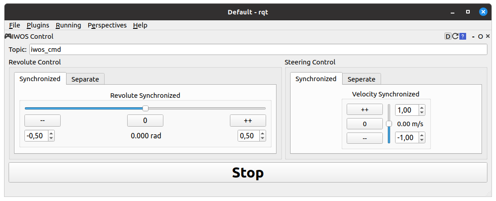
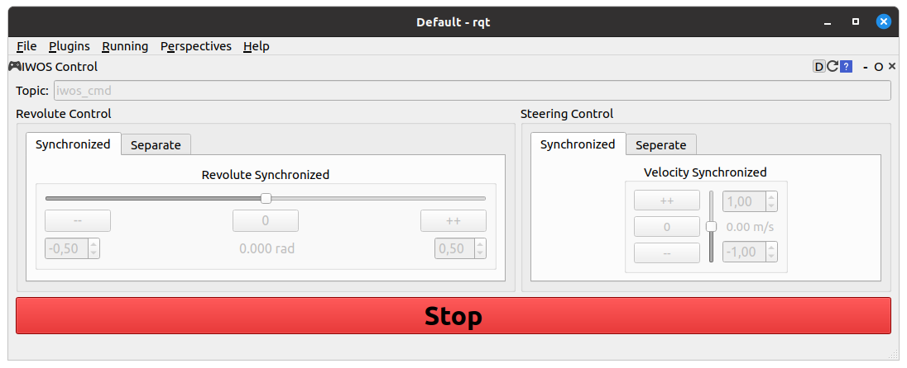
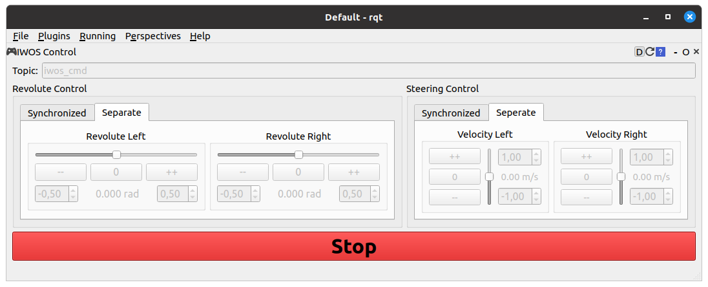

# TUW IWOS

## `tuw_iwos`
Metapackage for `tuw_iwos`.

## `tuw_iwos_control_plugin`
Plugin for ros [rqt][rqt] to send [JointIWS][JointIWS] messages from the [`tuw_msgs` package][tuw_msgs].
The messages contain `cmd_velocity` for the steering array and `cmd_position` or `cmd_torque` for the revolute array.
With the plugin these arrays are filled with values for left (index 0) and right (index 1).
The plugin allows controlling either steering and revolute synchronous (same value for left and right) or separated (different values for left and right).
The plugin sends `cmd_velocity` (unit: m/s) values for the steering and `cmd_position` (uint: rad) values for commands.

Start the plugin with:
```
rosrun tuw_iwos_control_plugin tuw_iwos_control_plugin
```
| Synchronized | Separate |
|:---:|:---:|
|  |  |

The stop the servos and motors a message with steering velocity (m/s) of zero and revolute torque (nm) of zero is sent.
Pressing the _stop_ button disables the UI.
Pressing the _stop_ button again enables the UI.
No message is sent until any value in the UI is changed.

| Synchronized | Separate |
|:---:|:---:|
 | 

## `tuw_iwos_launches`
Package containing launch files for the IWOS robot.
- `iwos_gamepad_control.launch`: launch drivers for steering and revolute and launch a node to publish command with the Logitech F710 gamepad.

[rqt]: http://wiki.ros.org/rqt
[JointIWS]: https://github.com/tuw-robotics/tuw_msgs/blob/master/tuw_nav_msgs/msg/JointsIWS.msg
[tuw_msgs]: https://github.com/tuw-robotics/tuw_msgs
