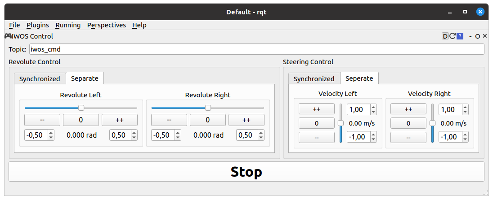

# TUW IWOS

## TUW IWOS
Metapackage for `tuw_iwos`.

## TUW IWOS CONTROL PLUGIN
Plugin for ros [rqt][1] to send [JointIWS][2] messages from the [`tuw_msgs` package][3].
The messages contain cmd_velocity for the steering array and cmd_position or cmd_torque for the revolute array.
With the plugin these arrays are filled with values for left (index 0) and right (index 1).
The plugin allows to control steering and revolute either synchronous (same value for left and right) or separated (different values for left and right).
The plugin sends cmd_velocity (unit: m/s) values for the steering and cmd_position (rad) values for commands.

Start the plugin with:
```
rosrun tuw_iwos_control_plugin tuw_iwos_control_plugin
```

 <div>
    
    
</div> 

The stop the servos and motors a message with steering velocity (m/s) of zero and revolute torque (nm) of zero is sent.
Pressing the _stop_ button disables the UI.
Pressing the _stop_ button again enables the UI.
No message is sent until any value in the UI is changed.

 <div>
    
    
</div> 


[1]: http://wiki.ros.org/rqt
[2]: https://github.com/tuw-robotics/tuw_msgs/blob/master/tuw_nav_msgs/msg/JointsIWS.msg
[3]: https://github.com/tuw-robotics/tuw_msgs
